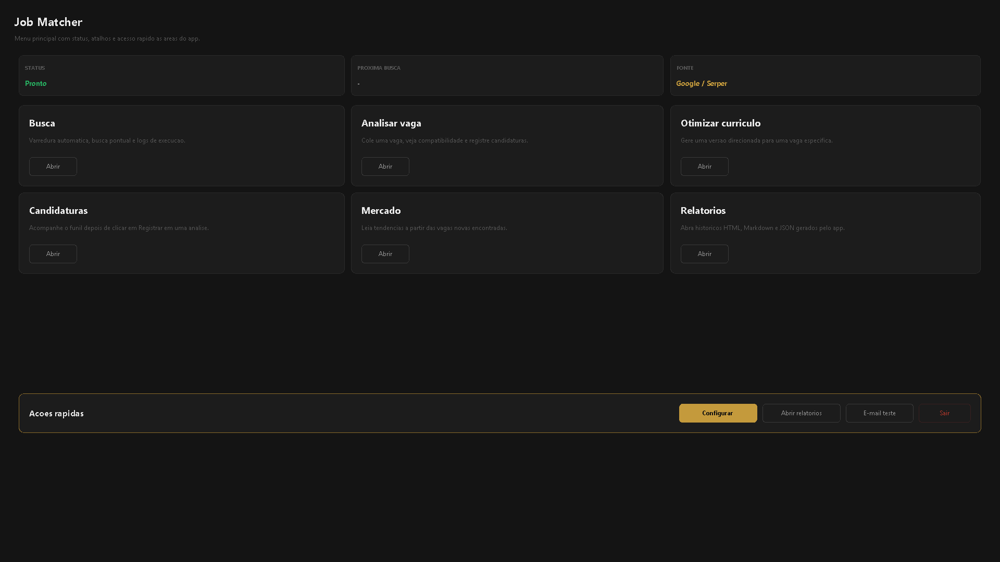

# Guia do Usuario - Job Matcher

Este guia explica como instalar, configurar, usar e entender o Job Matcher.

## Demonstracao visual



O GIF acima mostra o fluxo principal do app: menu, busca, analise de vaga, otimizacao de curriculo, candidaturas, mercado e relatorios.

## 1. O que o sistema faz

O Job Matcher procura vagas usando Google via Serper, le as paginas encontradas, compara cada vaga com o perfil do usuario usando IA e envia por e-mail os melhores resultados.

Para cada vaga analisada, ele gera:

- score de compatibilidade de 0 a 100.
- pontos fortes do usuario para aquela vaga.
- gaps reais.
- resumo curto do motivo do score.
- sugestao de headline para curriculo direcionado.
- habilidades e experiencias que devem aparecer primeiro no curriculo.
- ajustes honestos para deixar o curriculo mais profissional para aquela vaga.

O sistema nao cria candidatura automaticamente e nao garante contratacao. Ele ajuda a encontrar vagas melhores e a adaptar o curriculo com base no que o usuario realmente sabe.

Na interface desktop, tambem existem abas para uso manual:

- `Menu principal`: mostra status, atalhos e acesso rapido as areas do app.
- `Busca`: configura e executa varreduras de vagas.
- `Analisar vaga`: cola uma vaga especifica e recebe um diagnostico de compatibilidade.
- `Otimizar curriculo`: cola uma vaga especifica e recebe sugestoes de headline, resumo, skills e bullets baseadas no curriculo/perfil atual.
- `Candidaturas`: acompanha vagas registradas, etapas, notas, contatos e proximas acoes.
- `Mercado`: le o historico local de vagas e mostra tendencias.
- `Relatorios`: mostra o historico local de varreduras, analises e otimizacoes.

A otimizacao nao deve inventar experiencia. Ela serve para reposicionar e reescrever melhor o que ja existe.

## 2. O que precisa antes de usar

Voce precisa de:

- uma API key da Groq.
- uma API key do Serper.
- uma conta Gmail.
- uma senha de app do Google para envio de e-mail.
- um arquivo `.txt` com informacoes sobre voce.
- um curriculo em PDF.

## 3. Como pegar API key da Groq

1. Acesse `https://console.groq.com/keys`.
2. Entre ou crie uma conta.
3. Clique para criar uma nova API key.
4. Copie a chave gerada.
5. No Job Matcher, clique em `Configurar`.
6. Cole a chave no campo `API da IA`.

O modelo padrao usado pelo app e `llama-3.3-70b-versatile`.

Na tela `Configurar`, use `Testar IA` para confirmar se a chave e o modelo estao funcionando.

## 4. Como pegar API key do Serper

1. Acesse `https://serper.dev`.
2. Crie uma conta.
3. Abra a area de API key.
4. Copie a chave.
5. No Job Matcher, clique em `Configurar`.
6. Cole a chave no campo `API Serper`.

O Serper e usado para pesquisar vagas no Google de forma automatizada. Sem essa chave, a fonte principal de busca nao funciona.

Na tela `Configurar`, use `Testar Serper` para validar a chave antes de iniciar uma busca.

## 5. Como criar senha de app do Gmail

A senha de app nao e sua senha normal do Gmail. Ela e uma senha separada, criada so para aplicativos.

1. Acesse `https://myaccount.google.com/security`.
2. Entre na sua conta Google.
3. Ative a `Verificacao em duas etapas`, se ainda nao estiver ativa.
4. Depois de ativar, procure por `Senhas de app`.
5. Crie uma nova senha de app para `Mail` ou use um nome como `Job Matcher`.
6. O Google vai mostrar uma senha de 16 caracteres.
7. Copie essa senha.
8. No Job Matcher, cole no campo `Senha de app do Gmail`.

No campo `Gmail remetente`, coloque o Gmail que vai enviar as mensagens.

No campo `E-mail que recebera os matches`, coloque o e-mail que vai receber os resultados. Pode ser o mesmo Gmail.

Na tela `Configurar`, use `Testar Gmail` para conferir se o login SMTP esta correto.

## 6. Como preparar o arquivo TXT de perfil

Crie um arquivo `.txt` com tudo que voce sabe sobre voce profissionalmente.

Inclua:

- nome.
- cargo alvo.
- localizacao.
- e-mail.
- LinkedIn.
- GitHub ou portfolio.
- resumo profissional.
- tecnologias.
- experiencias.
- projetos.
- formacao.
- certificacoes.
- idiomas.
- conquistas.
- tipos de vaga que voce quer.
- tipos de vaga que voce nao quer.

Quanto mais claro for esse arquivo, melhor a IA consegue comparar seu perfil com as vagas.

## 7. Como configurar no app

1. Abra `JobMatcherApp.exe`.
2. Clique em `Configurar`.
3. Preencha IA, Serper, Gmail, senha de app e e-mail destino.
4. Selecione o arquivo `.txt` do perfil.
5. Selecione o PDF do curriculo.
6. Edite as areas, cargos ou stacks principais, um por linha.
7. Edite a senioridade desejada, um por linha.
8. Edite a modalidade de trabalho, um por linha.
9. Edite os filtros de localizacao aceitos, um por linha.
10. Opcionalmente, informe empresas alvo.
11. Opcionalmente, informe queries manuais extras.
12. Clique em `Salvar configuracao`.
13. Clique em `E-mail teste` para confirmar se o envio funciona.
14. Clique em `Buscar agora` para testar uma busca.
15. Clique em `Iniciar monitoramento` para deixar monitorando em intervalos.

## 7.1. Como preencher os campos de busca

`Pais/regiao principal da busca` e usado como contexto geral da pesquisa. Exemplos:

```text
Brasil
Portugal
United States
Sao Paulo
Florianopolis
Remote
```

`Areas, cargos ou stacks principais` define o centro da busca. Exemplos:

```text
Backend Developer
Java
Spring Boot
Frontend Developer
React
Data Analyst
Product Manager
QA Analyst
Mobile Developer
```

`Senioridade desejada` controla o nivel das vagas. Exemplos:

```text
Estagio
Junior
Pleno
Senior
Lead
Trainee
Entry Level
```

`Modalidade de trabalho` controla o formato desejado. Exemplos:

```text
Remoto
Home Office
Hibrido
Presencial
Remote
On-site
```

`Filtros de localizacao aceitos` ajuda o sistema a descartar vagas fora do que voce aceita. Exemplos:

```text
remoto
remote
home office
sao paulo
florianopolis
belo horizonte
lisboa
```

`Empresas alvo opcionais` prioriza buscas por empresas especificas. Exemplos:

```text
Nubank
Mercado Livre
Itaú
Google
Microsoft
```

`Queries manuais extras` sao buscas prontas que voce quer forcar. Exemplos:

```text
Java Backend Pleno Remoto
React Junior Remote
Data Analyst Entry Level
Product Manager Hibrido Sao Paulo
```

O sistema combina automaticamente areas, senioridade, modalidade e empresas para criar varias buscas. Por isso, nao precisa repetir tudo em todos os campos.

## 7.2. Como usar as abas manuais

Na aba `Analisar vaga`:

1. Cole a descricao completa da vaga.
2. Informe titulo e empresa se quiser.
3. Clique em `Analisar compatibilidade`.
4. O app mostra score, pontos fortes, gaps, melhorias recomendadas e proxima acao.
5. Clique em `Otimizar esta vaga` se quiser levar a mesma vaga direto para a aba de otimizacao.
6. A analise tambem e salva em `reports/` como JSON e Markdown.

Na aba `Otimizar curriculo`:

1. Cole a descricao completa da vaga.
2. Ou clique em `Usar vaga analisada` para reaproveitar a ultima vaga analisada.
3. Informe titulo e empresa se quiser.
4. Clique em `Gerar otimizacao`.
5. O app sugere headline, resumo profissional, skills prioritarias, experiencias para priorizar, bullets sugeridos, itens para reduzir e avisos de honestidade.
6. A otimizacao tambem e salva em `reports/` como JSON e Markdown.

Na aba `Candidaturas`:

1. Veja as vagas registradas a partir de uma analise.
2. Atualize etapa, contato, notas e proxima acao.
3. Acompanhe metricas simples do funil.
4. Revise alertas de follow-up quando uma candidatura ficar parada.

Na aba `Mercado`:

1. Clique para gerar ou atualizar a leitura de tendencias.
2. Veja tecnologias, senioridades, modalidades e empresas mais frequentes.
3. Use as lacunas como apoio para ajustar curriculo e foco de estudo.

Na aba `Relatorios`:

1. Veja os ultimos relatorios locais.
2. Clique em `Abrir` para abrir o Markdown daquele relatorio.
3. Clique em `Atualizar` se acabou de gerar algo novo.

Use os botoes de copiar para levar o texto para um editor de curriculo. Revise tudo antes de usar.

## 8. Onde as informacoes ficam salvas

As configuracoes sao persistentes.

No Windows, o app tenta salvar em:

```text
%APPDATA%\JobMatcher\config.json
%APPDATA%\JobMatcher\job_cache.json
%APPDATA%\JobMatcher\documents\
```

Se o Windows bloquear essa pasta, o app usa:

```text
user_data\config.json
user_data\job_cache.json
user_data\documents\
```

O arquivo `config.json` guarda a configuracao. Os arquivos selecionados pelo usuario sao copiados para `documents`.

## 9. Seguranca

As chaves sensiveis sao:

- API da IA.
- API key do Serper.
- senha de app do Gmail.

No Windows, o app salva esses campos protegidos com DPAPI, a protecao nativa do Windows vinculada ao usuario logado. Isso significa que o arquivo salvo nao deve expor as chaves em texto puro.

Importante:

- Nao envie sua pasta `%APPDATA%\JobMatcher` para outras pessoas.
- Nao publique `config.json`.
- Nao publique `job_matcher.log`.
- Nao compartilhe prints da tela de configuracao.
- Se suspeitar vazamento, revogue a chave na Groq, revogue a chave no Serper e apague a senha de app no Google.
- A protecao DPAPI vale para o Windows e para o usuario logado. Em outros sistemas, a protecao pode depender das permissoes do arquivo.

O executavel distribuido nao deve conter credenciais pessoais fixas.

## 10. Como a memoria de vagas repetidas funciona

O Job Matcher salva vagas ja analisadas em `job_cache.json`.

Enquanto esse arquivo existir, o sistema evita analisar novamente a mesma vaga quando o identificador da vaga for igual.

Limitacoes importantes desta versao:

- Se voce apagar `job_cache.json`, o sistema pode repetir vagas antigas.
- Se voce mover o app para outro computador sem levar a pasta de dados, a memoria de vagas analisadas nao acompanha.
- Se o site mudar a URL ou o identificador da vaga, a mesma vaga pode aparecer como nova.
- Se o computador dormir, desligar ou perder internet, o app nao monitora durante esse periodo.
- Para acompanhar vagas continuamente, mantenha o sistema aberto, acordado e com internet.

Em resumo: a memoria local ajuda a evitar repeticao, mas ela depende do arquivo local e do app estar rodando nos horarios de varredura.

## 11. Como o sistema funciona por dentro

1. O app carrega `config.json`.
2. O app monta termos de busca.
3. O Serper pesquisa vagas no Google.
4. O sistema baixa e filtra paginas de vagas.
5. Vagas repetidas sao ignoradas usando `job_cache.json`.
6. O perfil do usuario e montado com TXT + PDF.
7. A IA analisa perfil contra descricao da vaga.
8. O score e limitado por regras conservadoras para evitar exagero.
9. Resultados acima do score minimo entram no resumo.
10. O app salva relatorios em `reports`.
11. O app envia e-mail com os melhores matches e sugestoes de curriculo.

## 12. Arquivos importantes

```text
JobMatcherApp.exe              Aplicativo desktop.
config/settings.py             Defaults seguros e leitura da config do usuario.
core/user_config.py            Salva e carrega configuracoes persistentes.
core/secure_store.py           Protege segredos com DPAPI no Windows.
core/cache.py                  Memoria local de vagas analisadas.
core/resume_parser.py          Le TXT e PDF.
core/matcher.py                Calcula match e sugestoes de curriculo.
notifier/email_notifier.py     Envia e-mails.
reports/                       Relatorios das varreduras.
core/job_analyzer.py           Analise manual de uma vaga.
core/resume_optimizer.py       Otimizacao de curriculo para uma vaga.
```

## 13. Problemas comuns

Se o e-mail nao chega:

- confirme se a senha usada e senha de app, nao a senha normal do Gmail.
- confirme se a verificacao em duas etapas esta ativa.
- confira se o Gmail remetente esta correto.
- veja se o e-mail caiu em spam.

Se nao encontra vagas:

- confira a API key do Serper.
- tente termos de busca mais simples.
- reduza filtros muito especificos.
- rode uma `Varredura unica`.

Se o score parece errado:

- melhore o TXT de perfil.
- inclua projetos reais e tecnologias reais.
- confira se o curriculo PDF esta legivel.
- veja os gaps e as regras conservadoras no relatorio.
