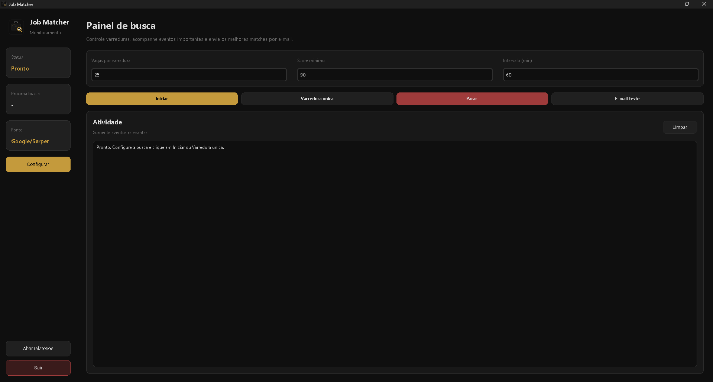
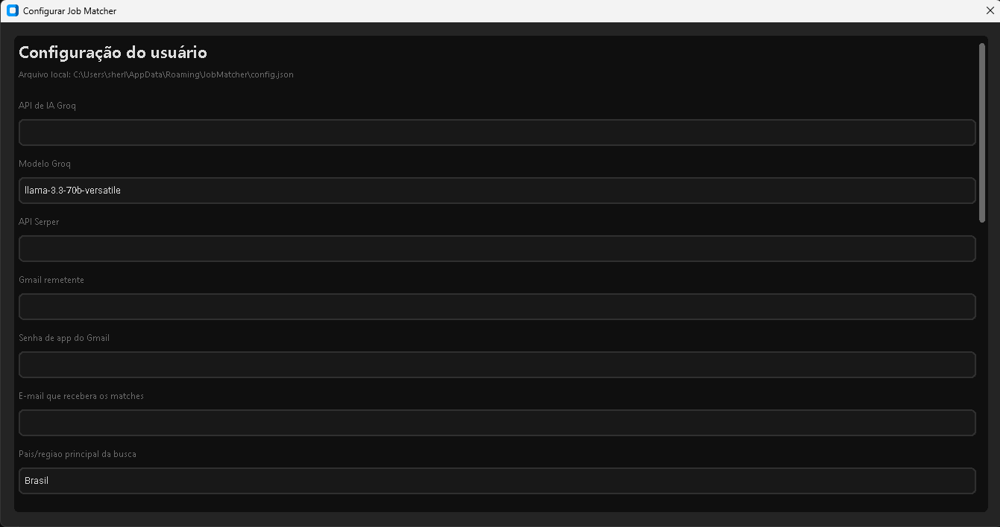
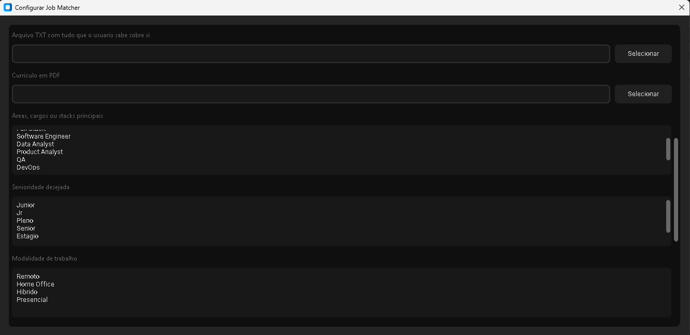
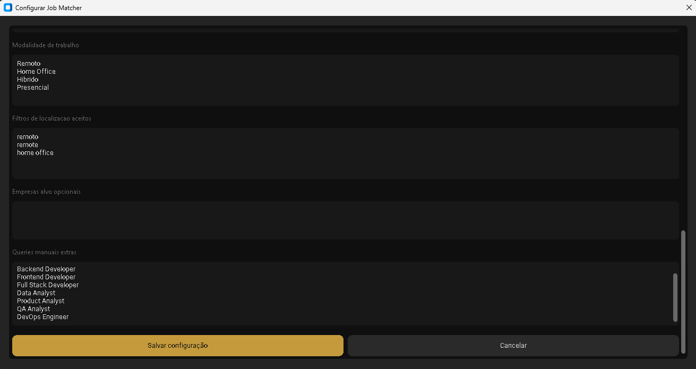

<div align="center">

# Job Matcher

### Cansado de mandar curriculo no escuro?

**Versao:** `0.0.7`

O Job Matcher busca vagas, calcula sua compatibilidade real e manda os melhores matches por e-mail automaticamente, enquanto voce faz outra coisa.

<br>

[](https://github.com/cherohn/job-matcher/releases/tag/v0.0.7)

*Gratuito · Sem instalacao · Traga suas proprias APIs*

</div>

---

## Por que isso existe

Procurar emprego manualmente e frustrante por um motivo especifico: voce nao sabe se a vaga vale seu tempo antes de ler tudo, pesquisar a empresa, montar a candidatura e descobrir, depois de dias, que ela pedia Angular e voce e backend.

Eu queria uma ferramenta que me dissesse:

> "Essa vaga aqui esta boa, mas ela pede React e voce e backend, entao o fit real e 72%, nao 90%. Ja essa outra, a stack bate, o nivel bate, e ainda da para melhorar seu curriculo nesses dois pontos especificos."

Nao encontrei nada assim. Entao construi.

---

## Download

<div align="center">

### [Clique aqui para baixar o Job Matcher para Windows](https://github.com/cherohn/job-matcher/releases/tag/v0.0.7)

</div>

```text
1. Baixe JobMatcherApp.zip na pagina de releases
2. Extraia o zip
3. Execute JobMatcherApp.exe
```

Nao precisa instalar Python, Node, nem nada. So baixar e rodar.

> **Requisito:** Windows 10 ou superior

---

## Interface

### Painel principal


Configure quantas vagas analisar por varredura, defina o score minimo de compatibilidade e o intervalo entre buscas. O log mostra so eventos relevantes, sem spam.

---

### Configuracao de credenciais


Suas chaves de API e senha do Gmail sao armazenadas com **DPAPI do Windows**, nunca em texto puro no disco.

---

### Configuracao de perfil e filtros


Selecione as areas, niveis de senioridade e modalidades de trabalho que fazem sentido para voce. O app so busca o que voce quer.

---

### Filtros avancados


Filtros de localizacao aceitos, empresas-alvo opcionais e queries manuais extras para afinar ainda mais a busca.

---

## O que ele faz

- Busca vagas no Google usando os termos e filtros que voce configurar.
- Le e filtra o conteudo real das paginas de vaga.
- Calcula um **score de compatibilidade** entre a vaga e o seu curriculo/perfil usando IA.
- Manda os melhores matches por **e-mail automaticamente** no intervalo definido.
- Analisa uma vaga colada manualmente na aba **Analisar vaga**.
- Simula a leitura ATS do curriculo em PDF para uma vaga especifica.
- Gera carta de apresentacao contextualizada para uma vaga especifica.
- Salva analises manuais em JSON e Markdown dentro de `reports/`.
- Otimiza o direcionamento do curriculo para uma vaga especifica na aba **Otimizar curriculo**.
- Reaproveita uma vaga analisada para otimizar o curriculo sem colar a descricao novamente.
- Mostra historico local de relatorios dentro do app.
- Abre relatorios em HTML no navegador com visual escuro na paleta Iron.
- Gera relatorios ATS em HTML com score, risco, keywords presentes e ausentes.
- Gera cartas em HTML com idioma detectado, contagem de palavras e avisos de revisao.
- Inclui testes rapidos de IA, Serper e Gmail na configuracao.
- Salva otimizacoes de curriculo em JSON e Markdown dentro de `reports/`.
- Gera uma **analise honesta por vaga**:
  - pontos fortes do seu perfil para aquela posicao;
  - o que nao bate e por que;
  - sugestoes especificas para melhorar o curriculo para aquela vaga.
- Evita repeticao com **cache local** e bloqueio de vagas repetidas por 30 dias.
- Reduz uso do Serper ao limitar queries e parar a coleta quando ja ha vagas novas suficientes.
- Salva **relatorios locais** em `reports/` para consulta posterior.

A analise manual nao cria um novo curriculo. Ela apenas explica o que melhorar, destacar, reduzir ou verificar no curriculo atual.

A otimizacao de curriculo sugere headline, resumo, skills e bullets com base no perfil existente. Ela nao inventa experiencias e ainda nao exporta DOCX/PDF.

---

## Como funciona

```text
Voce configura os termos de busca e filtros
              |
              v
    Serper busca vagas no Google
              |
              v
   App le o conteudo real de cada vaga
              |
              v
  IA compara vaga x curriculo x perfil
              |
              v
   Score calculado -> abaixo do minimo, descarta
              |
              v
  Melhores matches enviados por Gmail com analise
              |
              v
  Relatorio salvo + cache atualizado
```

---

## O que voce precisa fornecer

O app nao cobra nada. Voce traz suas proprias credenciais:

| Credencial | Para que serve | Como obter |
|---|---|---|
| **API da IA** | IA que analisa as vagas | [console.groq.com/keys](https://console.groq.com/keys) |
| **Serper API Key** | Busca no Google | [serper.dev](https://serper.dev) |
| **Gmail + senha de app** | Envio dos matches | [Instrucoes no guia](GUIA_USUARIO.md) |
| **Arquivo de perfil (.txt)** | Seu perfil profissional | Voce escreve |
| **Curriculo (.pdf)** | Base para o score de fit | Seu curriculo atual |

Modelo padrao da IA:

```text
llama-3.3-70b-versatile
```

---

## Primeiros passos

1. Abra `JobMatcherApp.exe`.
2. Clique em **Configurar**.
3. Preencha suas credenciais de IA, Serper e Gmail.
4. Selecione seu arquivo de perfil `.txt` e curriculo `.pdf`.
5. Escolha as areas, senioridades e modalidades desejadas.
6. Configure os filtros de localizacao e queries extras se quiser.
7. Clique em **Salvar configuracao**.
8. Clique em **E-mail teste** para confirmar que esta chegando.
9. Clique em **Buscar agora** para testar uma vez.
10. Clique em **Iniciar monitoramento** para monitoramento continuo.

Guia completo com prints passo a passo: [GUIA_USUARIO.md](GUIA_USUARIO.md)

---

## Persistencia

As configuracoes sao salvas fora do executavel.

Local principal no Windows:

```text
%APPDATA%\JobMatcher\config.json
%APPDATA%\JobMatcher\job_cache.json
%APPDATA%\JobMatcher\documents\
```

Fallback portatil:

```text
user_data\config.json
user_data\job_cache.json
user_data\documents\
```

Arquivos TXT e PDF selecionados sao copiados para a pasta `documents` do app para continuar funcionando depois.

---

## Seguranca

Credenciais sensiveis sao protegidas com **DPAPI do Windows** antes de serem salvas. A protecao e vinculada ao seu usuario Windows.

Nunca compartilhe ou publique:

- `config.json`
- `job_cache.json`
- A pasta `user_data/` ou `%APPDATA%\JobMatcher`
- Prints da tela de configuracao
- `job_matcher.log`

Se alguma credencial vazar, revogue imediatamente em Groq, Serper ou Google e gere uma nova.

---

## Rodando pelo codigo-fonte

```powershell
git clone https://github.com/cherohn/job-matcher.git
cd job-matcher
pip install -r requirements.txt
python app_desktop.py
```

Para gerar o executavel:

```powershell
powershell -ExecutionPolicy Bypass -File .\build_exe.ps1
```

---

## Estrutura do projeto

```text
job-matcher/
|-- app_desktop.py
|-- main.py
|-- config/
|   `-- settings.py
|-- core/
|   |-- cache.py
|   |-- job_analyzer.py
|   |-- matcher.py
|   |-- report.py
|   |-- resume_parser.py
|   |-- secure_store.py
|   `-- user_config.py
|-- notifier/
|   `-- email_notifier.py
|-- scrapers/
|-- GUIA_USUARIO.md
|-- build_exe.ps1
`-- requirements.txt
```

---

## Limitacoes conhecidas (v0.0.7)

- Monitoramento continuo exige que o app fique aberto e o computador ligado.
- Cache local: se deletar `job_cache.json`, vagas antigas podem reaparecer antes do bloqueio de 30 dias.
- Protecao de credenciais com DPAPI funciona so no Windows por enquanto.
- Se um site de vagas mudar a URL, a mesma vaga pode parecer nova.
- A aba **Otimizar curriculo** gera texto e relatorio, mas ainda nao exporta DOCX/PDF.

---

## Roadmap

- [ ] Exportacao DOCX/PDF para curriculos otimizados.
- [ ] Instalador com setup guiado.
- [ ] Mais fontes de busca alem do Google/Serper.
- [ ] Deduplicacao mais robusta de vagas.
- [ ] Agendamento em background sem precisar manter o app aberto.
- [ ] Exportacao de relatorio em PDF.
- [ ] Suporte a credenciais seguras fora do Windows.

---

## Aviso

O Job Matcher nao garante entrevistas, ofertas ou emprego. E um assistente local que ajuda a encontrar vagas relevantes e melhorar o direcionamento do curriculo usando suas proprias credenciais e dados.

---

## Licenca

MIT - pode usar, modificar e distribuir livremente.

---

<div align="center">

Feito por **Matheus Garcez** · [github.com/cherohn](https://github.com/cherohn) · [LinkedIn](https://linkedin.com/in/matheus-garcez-172377249)

</div>
